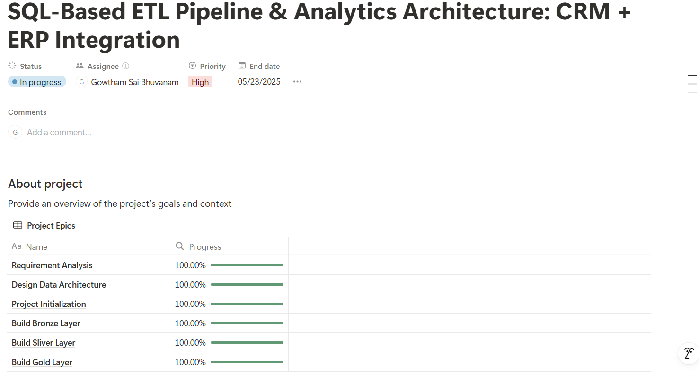

# 🏢 SQL-Based ETL Pipeline & Analytics Architecture: CRM + ERP Integration

Welcome to the **SQL-Based ETL Pipeline & Analytics Architecture: CRM + ERP Integration** repository! 🚀
This portfolio project showcases the end-to-end implementation of a modern data warehouse and analytics solution. It highlights data engineering best practices, efficient data modeling techniques, and actionable business intelligence using SQL and visualization tools.

---

## 🧱 Data Architecture – Medallion Design

The project follows the **Medallion Architecture** with three key layers:

* **🔶 Bronze Layer**: Stores raw data ingested as-is from the source systems (ERP and CRM) via CSV files into SQL Server.
* **⚪ Silver Layer**: Transforms, cleanses, and standardizes the raw data for analytical usability.
* **🔷 Gold Layer**: Final business-ready layer modeled in a **Star Schema** for reporting and analysis.

See the visual documentation in the `docs/` folder:

* `dw_architecture.png`
* `star_schema.png`
* `data_workflow.png`
* `data_integration_model.png`

---

## 📌 Project Overview

This project demonstrates:

* **Data Architecture** using modern warehousing principles
* **ETL Pipelines** to extract, transform, and load data into SQL Server
* **Data Modeling** with Fact and Dimension tables for analytics
* **Analytics & Reporting** using SQL queries and BI dashboards to generate insights

---

## 🎯 Objectives

### 📦 Data Engineering Goals:

* Design and implement a scalable warehouse in SQL Server.
* Integrate data from two source systems (ERP & CRM).
* Ensure data quality through cleansing and transformation.
* Model analytical data in a star schema format.
* Document the entire pipeline and model for stakeholder usage.

### 📊 Analytics Goals:

* Derive insights on:

  * Customer behavior
  * Product performance
  * Sales trends
* Create SQL-based reports to support strategic business decisions.

---

## 🛠️ Tools & Resources Used

| Tool               | Purpose                                      |
| ------------------ | -------------------------------------------- |
| SQL Server Express | Database for data warehouse                  |
| SSMS               | Database interaction and management          |
| Draw\.io           | Data flow, architecture, and schema diagrams |
| Notion             | Project management and task tracking         |
| GitHub             | Version control and collaboration            |
| Tableau / Power BI (Optional) | BI dashboarding and visualization tools        |

---

## 📂 Repository Structure

```
SQL-DATA-WAREHOUSE/
│
├── datasets/                  # Raw CRM and ERP CSV files
│   ├── source_crm/
│   └── source_erp/
│
├── docs/                      # Visual documentation and diagrams
│   ├── dw_architecture.png
│   ├── data_workflow.png
│   ├── star_schema.png
│   ├── data_integration_model.png
│   └── naming.md
│
├── scripts/                   # SQL scripts categorized by layers
│   ├── bronze/
│   │   ├── ddl_bronze.sql
│   │   ├── load_bronze.sql
│   │   └── data_dictionary_bronze.md
│   ├── silver/
│   │   ├── ddl_silver.sql
│   │   ├── load_silver.sql
│   │   └── data_dictionary_silver.md
│   └── gold/
│       ├── ddl_gold.sql
│       └── data_dictionary_gold.md
│
├── tests/                     # SQL data quality checks
│   ├── qc_silver.sql
│   └── qc_gold.sql
│
├── init_database.sql          # Creates database & schemas (bronze, silver, gold)
└── README.md
```

---

## 🚀 How to Run

1. **Setup Database**
   Run `init_database.sql` to initialize the `DataWarehouse` and create schemas.

2. **Create Tables**
   Execute all `ddl_*.sql` scripts from each layer (`bronze`, `silver`, `gold`).

3. **Load Data**

   * Use `load_bronze.sql` to bulk load raw CSVs
   * Execute `load_silver.sql` for cleansing & transformation

4. **Explore Views**

   * The Gold layer exposes `dim_customers`, `dim_products`, and `fact_sales` views

5. **Run Tests**

   * Validate data integrity using quality checks in the `tests/` folder

---

## 📊 Sample Business Questions Answered

* Which customer segments generate the most revenue?
* What are the top-selling products by region?
* How do sales trends vary month-over-month?
* What CRM leads converted into actual purchases?

---

## 🧪 Test & Validation

To ensure accuracy and quality, the project includes:

* Null and duplicates checks
* Data type validations
* Referential integrity tests

---



---

## 📘 Resources

* [Naming Conventions](docs/naming.md)
* [Data Catalogs](scripts/*/data_dictionary_*.md)
* [Visual Workflows](docs/*.png)

---

## 🙌 About the Author

Hi! I’m **Gowtham Sai Bhuvanam**, an aspiring Data Engineer and Analyst passionate about turning raw data into insights. This project demonstrates my skills in ETL design, data modeling, and SQL analytics as part of my professional portfolio.

📌 [LinkedIn](https://linkedin.com/in/gowthamsaib)
🌐 [Portfolio (Coming Soon)]()
🎓 MS in Artificial Intelligence and Business Analytics @ USF (May 2025)

---

## 📬 Let's Connect!

Feel free to star ⭐ this repo and connect with me. I’d love to learn, collaborate, and grow with the data community!

---

## 📝 License

This project is open-source under the **MIT License**.
Feel free to use, modify, and share with proper attribution.
